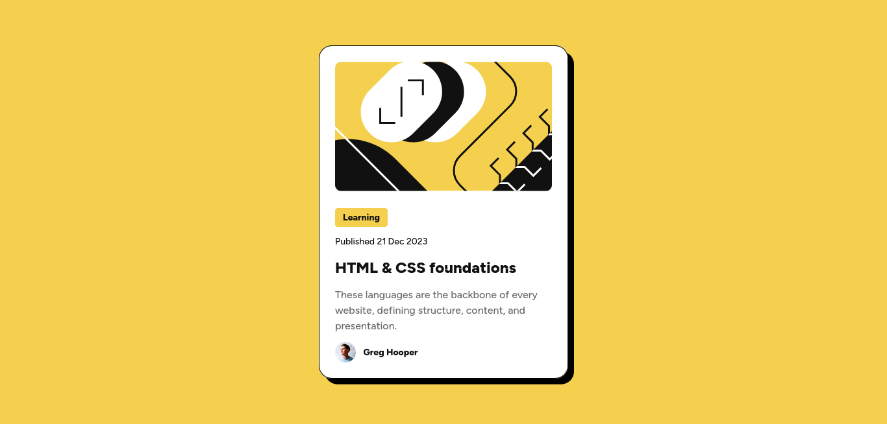

# Frontend Mentor - Blog preview card solution

This is a solution to the [Blog preview card challenge on Frontend Mentor](https://www.frontendmentor.io/challenges/blog-preview-card-ckPaj01IcS). Frontend Mentor challenges help you improve your coding skills by building realistic projects.

## Table of contents

- [Overview](#overview)
  - [The challenge](#the-challenge)
  - [Screenshot](#screenshot)
  - [Links](#links)
- [My process](#my-process)
  - [Built with](#built-with)
  - [What I learned](#what-i-learned)
  - [Continued development](#continued-development)
  - [Useful resources](#useful-resources)
- [Acknowledgments](#acknowledgments)

## Overview

### The challenge

Users should be able to:

- See hover and focus states for all interactive elements on the page

### Screenshot



### Links

- Solution URL: [Frontend Mentor](https://www.frontendmentor.io/solutions/blog-preview-card-using-html-and-css-Uhx1ugShb_)
- Live Site URL: [GitHub Pages](https://henrychris.github.io/blog-preview-card/)

## My process

### Built with

- Semantic HTML5 markup
- CSS
- Flexbox

### What I learned

- Learned to use `rem` lengths dynamically/responsively change font sizes on a page.

```css
html {
  font-size: 16px;
}

p {
  font-size: 2rem; /* font size = (2 * 16px) */
}
```

- Learned to use `@font-face` with variable font files. Refer to the font file & specify the available weights.

```css
@font-face {
    font-family: "Figtree";
    src: local("Figtree"),
        url("../assets/fonts/Figtree-VariableFont_wght.ttf") format("truetype");
    font-weight: normal, 500, 800;
}
```

### Continued development

Still need to use Flexbox in more complex situations.

### Useful resources

- [Font Face - Simmons Edu](http://web.simmons.edu/~grovesd/comm244/notes/week5/font-face) - This helped me figure out `@font-face`.

## Acknowledgments

Thanks to `@itsdarkstar` on the Frontend Mentors Discord. He answered my question about using `@font-face` properly.
